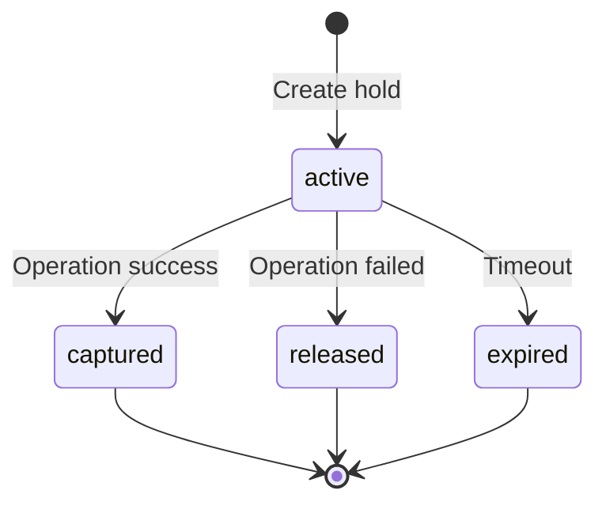

## Overview

BuddyPie uses a credit-based billing system with multiple payment rails:

- **Subscription Credits** - Recurring grants from Clerk subscriptions
- **x402 Protocol** - Direct USDC payments via HTTP 402
- **Delegated Budgets** - MetaMask smart account delegation

## Credit Accounts

### Structure

Each user has a credit account with:

| Balance Type | Description |
|--------------|-------------|
| `availableUsdCents` | Spendable balance |
| `heldUsdCents` | Reserved for active operations |
| `lifetimeCreditedUsdCents` | Total credits received |
| `lifetimeSpentUsdCents` | Total credits spent |

### Environments

| Environment | Network | Use Case |
|-------------|---------|----------|
| `staging` | Base Sepolia | Testing |
| `production` | Base Mainnet | Live payments |

### Getting Wallet State

```ts
const wallet = await convex.query(api.billing.getWallet, {
  environment: 'production',
})
```

## Payment Rails

### Clerk Credit (Subscription)

Users with active subscriptions receive periodic credit grants.

**Flow:**
1. User subscribes via Clerk
2. Webhook triggers `applySubscriptionCreditGrant`
3. Credits added to wallet
4. Ledger entry recorded

**Grant Types:**
- Monthly recurring grants
- Annual lump-sum grants

### x402 Protocol

Direct USDC payments via HTTP 402 responses.

**Configuration:**
```bash
# In Convex environment
X402_PAY_TO_ADDRESS=0x...  # Receiving wallet
```

**Top-up Flow:**
```ts
const result = await convex.mutation(api.billing.topUpWithX402, {
  grossUsdCents: 1000,  // $10.00
})
// Returns payment details for client-side signing
```

**Networks:**
| Network | Chain ID | USDC Address |
|---------|----------|--------------|
| Base Sepolia | 84532 | `0x036CbD53842c5426634e7929541eC2318f3dCF7e` |
| Base Mainnet | 8453 | `0x833589fCD6eDb6E08f4c7C32D4f71b54bdA02913` |

### MetaMask Delegated Budget

Onchain spending limits with smart account delegation.

**Budget Types:**
| Type | Description |
|------|-------------|
| `fixed` | One-time budget |
| `periodic` | Resets on interval |

**Intervals:**
- `day` - Resets daily
- `week` - Resets weekly
- `month` - Resets every 30 days

**Creation Flow:**
1. User requests budget creation
2. System generates delegation payload
3. User signs with MetaMask
4. Smart account approves spending
5. Budget activated onchain

**Example:**
```ts
const budget = await convex.mutation(api.billing.createDelegatedBudget, {
  budgetType: 'periodic',
  interval: 'month',
  configuredAmountUsdCents: 10000,  // $100/month
  network: 'base-sepolia',
})
```

## Credit Holds

### Purpose

Holds reserve credits during operations:

| Purpose | Description |
|---------|-------------|
| `sandbox_launch` | Sandbox creation |
| `preview_boot` | App preview server |
| `ssh_access` | SSH session |
| `web_terminal` | Web terminal |
| `generic` | Other operations |

### Lifecycle



### Hold vs Capture

**Hold:**
- Reserves credits
- Reduces available balance
- Increases held balance

**Capture:**
- Converts hold to charge
- Records billing event
- Creates ledger entries

**Release:**
- Returns credits to available
- No charge recorded

## Pricing

### Event Pricing

| Event | Cost |
|-------|------|
| `sandbox_launch` | Base launch fee |
| `preview_boot` | Per-hour preview |
| `ssh_access` | Per-hour SSH |
| `web_terminal` | Per-hour terminal |

Pricing is versioned via `unitPriceVersion` for auditability.

### Viewing Charges

```ts
const charges = await convex.query(api.billing.getSandboxCharges, {
  sandboxId: 'sandboxes_abc123',
})
```

## Ledger System

### Double-Entry Accounting

Every credit movement creates ledger entries:

| Reference Type | Description |
|----------------|-------------|
| `migration_opening` | Initial balance migration |
| `subscription_grant` | Subscription credits |
| `manual_grant` | Admin credit grant |
| `hold_created` | Hold placed |
| `hold_released` | Hold released |
| `hold_captured` | Hold converted to charge |
| `x402_charge` | x402 payment |
| `delegated_budget_charge` | Budget settlement |

### Balance Deltas

```ts
{
  amountUsdCents: 100,
  balanceDeltaAvailableUsdCents: -100,  // Reduced available
  balanceDeltaHeldUsdCents: 100,        // Increased held
}
```

## Subscription Management

### Clerk Integration

Subscriptions are tracked via Clerk webhooks:

1. User subscribes in Clerk
2. Webhook creates `clerkSubscriptionSnapshot`
3. `subscriptionCreditGrants` created
4. Credits applied to wallet

### Plan Detection

Plans are identified by slug:
- `pro-monthly`
- `pro-annual`
- Custom slugs

### Status Tracking

| Status | Meaning |
|--------|---------|
| `active` | Current subscription |
| `past_due` | Payment failed |
| `canceled` | User canceled |
| `ended` | Subscription terminated |

## Delegated Budget Settlement

### Onchain Flow

1. User creates budget via MetaMask
2. Smart account stores delegation
3. BuddyPie backend triggers settlements
4. USDC transferred to treasury

### Settlement Record

```ts
{
  delegatedBudgetId: `Id&lt;delegatedBudgets&gt;`
  sandboxId: `Id&lt;sandboxes&gt;`?
  chargeId: `Id&lt;billingCharges&gt;`?
  amountUsdCents: number
  txHash: string
  remainingAmountUsdCents: number
}
```

### Budget States

| Status | Description |
|--------|-------------|
| `pending` | Awaiting onchain confirmation |
| `active` | Ready for settlements |
| `revoked` | User revoked delegation |
| `expired` | Budget period ended |

## Wallet Top-up

### x402 Top-up Flow

1. User requests top-up amount
2. Backend generates payment payload
3. Client initiates USDC transfer
4. Webhook confirms settlement
5. Credits added to wallet

### Requirements

- User must have connected wallet
- Sufficient USDC on Base
- Correct network selected

## Idempotency

All billing operations use idempotency keys:

```ts
// Pattern examples
`sandbox-launch:${sandboxId}`
`sandbox-launch-capture:${sandboxId}`
`subscription-grant:${subscriptionId}:${periodStart}`
`x402-topup:${userId}:${timestamp}`
```

This prevents double-charges on retries.

## Troubleshooting

<Accordions>
  <Accordion id="insufficient-credits" title="Insufficient credits error">
    
    Check your available balance:
    
    ```ts
    const wallet = await convex.query(api.billing.getWallet, {})
    console.log(`Available: ${wallet.availableUsdCents / 100} USD`)
    ```
    
    Top up via x402 or wait for subscription grant.
    
  </Accordion>
  
  <Accordion id="hold-expired" title="Credit hold expired">
    
    Holds have a timeout. If an operation takes too long, the hold expires and credits are released.
    
    Check hold status:
    
    ```ts
    const sandbox = await convex.query(api.sandboxes.get, { sandboxId })
    // Check launchHoldId and status
    ```
    
  </Accordion>
  
  <Accordion id="budget-revoked" title="Delegated budget revoked">
    
    Users can revoke budgets at any time. The budget status becomes `revoked`.
    
    Create a new budget to continue onchain payments.
    
  </Accordion>
  
  <Accordion id="wrong-network" title="Wrong network error">
    
    Ensure your wallet is connected to the correct network:
    
    - Base Sepolia for testing
    - Base Mainnet for production
    
  </Accordion>
</Accordions>

## Next Steps

<Cards>
  <Card title="Smart Contracts" href="/docs/contracts">
    Onchain budget settlement contracts.
  </Card>
  <Card title="API Reference" href="/docs/api-reference">
    Billing function signatures.
  </Card>
</Cards>
