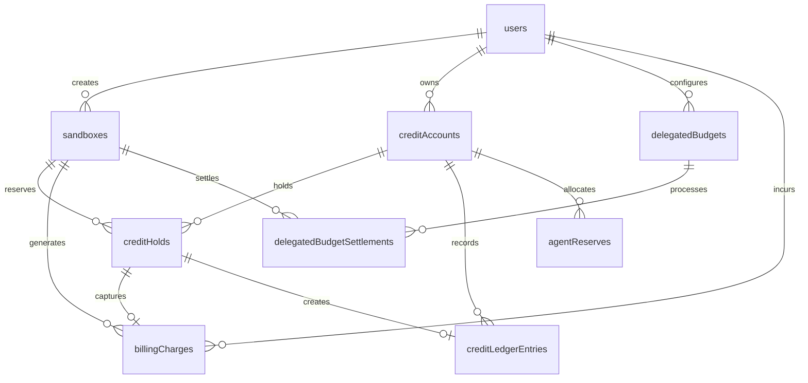

## Overview

BuddyPie uses Convex as its database with a relational-style schema. The data model supports user management, sandbox lifecycle, and multi-rail billing.

## Entity Relationship Diagram



## Core Tables

### users

User records synced from Clerk authentication.

| Field | Type | Description |
|-------|------|-------------|
| `tokenIdentifier` | string | Clerk token identifier |
| `clerkUserId` | string | Clerk user ID |
| `email` | string? | User email |
| `name` | string? | Display name |
| `imageUrl` | string? | Avatar URL |
| `lastSeenAt` | number | Last activity timestamp |

**Indexes:**
- `by_token_identifier` - Lookup by Clerk token
- `by_clerk_user_id` - Lookup by Clerk user ID

### sandboxes

Development sandbox instances.

| Field | Type | Description |
|-------|------|-------------|
| `userId` | `Id&lt;users&gt;` | Owner reference |
| `repoUrl` | string | Repository URL |
| `repoName` | string | Repository name |
| `repoBranch` | string? | Branch (optional) |
| `repoProvider` | 'github' \| 'git' | Repository type |
| `agentPresetId` | string? | Preset identifier |
| `agentProvider` | string? | AI provider |
| `agentModel` | string? | AI model |
| `status` | 'creating' \| 'ready' \| 'failed' | Current state |
| `daytonaSandboxId` | string? | Daytona sandbox ID |
| `opencodeSessionId` | string? | OpenCode session ID |
| `previewUrl` | string? | Preview URL |
| `workspacePath` | string? | Sandbox file path |
| `errorMessage` | string? | Failure reason |

**Indexes:**
- `by_user_and_created_at` - List user sandboxes

## Credit System Tables

### creditAccounts

User credit wallets.

| Field | Type | Description |
|-------|------|-------------|
| `userId` | `Id&lt;users&gt;` | Owner |
| `currency` | 'USD' | Currency type |
| `environment` | 'staging' \| 'production' | Environment |
| `fundingAsset` | 'USDC' | Funding token |
| `fundingNetwork` | 'base-sepolia' \| 'base-mainnet' | Blockchain network |
| `availableUsdCents` | number | Available balance |
| `heldUsdCents` | number | Amount on hold |
| `lifetimeCreditedUsdCents` | number | Total credits received |
| `lifetimeSpentUsdCents` | number | Total spent |

**Indexes:**
- `by_user_and_environment` - Lookup by user and env

### creditHolds

Temporary holds on credit accounts.

| Field | Type | Description |
|-------|------|-------------|
| `userId` | `Id&lt;users&gt;` | User reference |
| `accountId` | `Id&lt;creditAccounts&gt;` | Account reference |
| `sandboxId` | `Id&lt;sandboxes&gt;`? | Related sandbox |
| `agentPresetId` | string | Preset used |
| `purpose` | enum | Hold reason |
| `amountUsdCents` | number | Held amount |
| `sourcePaymentRail` | enum | Payment source |
| `status` | 'active' \| 'captured' \| 'released' \| 'expired' | Hold state |
| `expiresAt` | number | Expiration timestamp |
| `idempotencyKey` | string | Deduplication key |

**Purposes:**
- `sandbox_launch`
- `preview_boot`
- `ssh_access`
- `web_terminal`
- `generic`

**Indexes:**
- `by_account_and_status`
- `by_status_and_expires_at`
- `by_idempotency_key`

### billingCharges

Completed charge records.

| Field | Type | Description |
|-------|------|-------------|
| `userId` | `Id&lt;users&gt;` | User reference |
| `accountId` | `Id&lt;creditAccounts&gt;`? | Account reference |
| `sandboxId` | `Id&lt;sandboxes&gt;`? | Sandbox reference |
| `holdId` | `Id&lt;creditHolds&gt;`? | Source hold |
| `agentPresetId` | string | Preset used |
| `eventType` | enum | Charge type |
| `paymentRail` | enum | Payment method |
| `amountUsdCents` | number | Charged amount |
| `unitPriceVersion` | string | Pricing version |
| `description` | string | Human-readable description |
| `idempotencyKey` | string | Deduplication key |

**Payment Rails:**
- `clerk_credit` - Subscription credits
- `x402_direct` - x402 protocol
- `metamask_delegated` - Delegated budget
- `migration` - Data migration
- `manual_test` - Testing

**Indexes:**
- `by_user_and_created_at`
- `by_sandbox_and_created_at`
- `by_idempotency_key`

### creditLedgerEntries

Double-entry ledger for audit trail.

| Field | Type | Description |
|-------|------|-------------|
| `userId` | `Id&lt;users&gt;` | User reference |
| `accountId` | `Id&lt;creditAccounts&gt;` | Account reference |
| `sandboxId` | `Id&lt;sandboxes&gt;`? | Sandbox reference |
| `holdId` | `Id&lt;creditHolds&gt;`? | Hold reference |
| `chargeId` | `Id&lt;billingCharges&gt;`? | Charge reference |
| `paymentRail` | enum | Payment method |
| `referenceType` | enum | Entry type |
| `amountUsdCents` | number | Amount |
| `balanceDeltaAvailableUsdCents` | number | Available balance change |
| `balanceDeltaHeldUsdCents` | number | Held balance change |
| `description` | string | Description |

**Reference Types:**
- `migration_opening` - Initial migration
- `subscription_grant` - Subscription credit
- `manual_grant` - Manual credit
- `hold_created` - Hold placed
- `hold_released` - Hold released
- `hold_captured` - Hold captured
- `x402_charge` - x402 payment
- `delegated_budget_charge` - Budget settlement

## Subscription Tables

### clerkSubscriptionSnapshots

Clerk subscription state snapshots.

| Field | Type | Description |
|-------|------|-------------|
| `userId` | `Id&lt;users&gt;` | User reference |
| `clerkUserId` | string | Clerk user ID |
| `clerkSubscriptionId` | string | Subscription ID |
| `status` | enum | Subscription status |
| `planSlug` | string? | Plan identifier |
| `planName` | string? | Plan name |
| `planPeriod` | 'month' \| 'annual'? | Billing period |

### subscriptionCreditGrants

Periodic credit grants from subscriptions.

| Field | Type | Description |
|-------|------|-------------|
| `userId` | `Id&lt;users&gt;` | User reference |
| `accountId` | `Id&lt;creditAccounts&gt;` | Account reference |
| `clerkSubscriptionId` | string | Subscription ID |
| `amountUsdCents` | number | Granted amount |
| `periodStart` | number | Period start |
| `periodEnd` | number? | Period end |

## Delegated Budget Tables

### delegatedBudgets

MetaMask delegated budget configurations.

| Field | Type | Description |
|-------|------|-------------|
| `userId` | `Id&lt;users&gt;` | User reference |
| `status` | 'active' \| 'revoked' \| 'expired' \| 'pending' | Budget state |
| `budgetType` | 'fixed' \| 'periodic' | Budget type |
| `interval` | 'day' \| 'week' \| 'month'? | Reset interval |
| `token` | 'USDC' | Token type |
| `network` | 'base-sepolia' \| 'base-mainnet' | Network |
| `configuredAmountUsdCents` | number | Configured limit |
| `remainingAmountUsdCents` | number | Remaining balance |
| `ownerAddress` | string | Wallet address |
| `delegatorSmartAccount` | string | Smart account address |
| `delegateAddress` | string | Delegate address |
| `contractBudgetId` | string | Onchain budget ID |

### delegatedBudgetSettlements

Onchain settlement records.

| Field | Type | Description |
|-------|------|-------------|
| `userId` | `Id&lt;users&gt;` | User reference |
| `delegatedBudgetId` | `Id&lt;delegatedBudgets&gt;` | Budget reference |
| `sandboxId` | `Id&lt;sandboxes&gt;`? | Sandbox reference |
| `chargeId` | `Id&lt;billingCharges&gt;`? | Charge reference |
| `amountUsdCents` | number | Settled amount |
| `txHash` | string | Transaction hash |
| `remainingAmountUsdCents` | number | Remaining after settlement |

## Reserve System Tables

### agentReserves

Pre-funded balances for agent operations.

| Field | Type | Description |
|-------|------|-------------|
| `userId` | `Id&lt;users&gt;` | User reference |
| `accountId` | `Id&lt;billingAccounts&gt;` | Billing account |
| `agentPresetId` | string | Preset identifier |
| `allocatedUsdCents` | number | Total allocated |
| `availableUsdCents` | number | Available balance |
| `heldUsdCents` | number | Amount on hold |
| `spentUsdCentsLifetime` | number | Total spent |
| `status` | 'active' \| 'paused' \| 'closed' | Reserve state |

### reserveLeases

Temporary holds on agent reserves.

| Field | Type | Description |
|-------|------|-------------|
| `userId` | `Id&lt;users&gt;` | User reference |
| `agentReserveId` | `Id&lt;agentReserves&gt;` | Reserve reference |
| `sandboxId` | `Id&lt;sandboxes&gt;`? | Sandbox reference |
| `amountUsdCents` | number | Held amount |
| `status` | 'active' \| 'captured' \| 'released' \| 'expired' | Lease state |

### usageEvents

Granular usage tracking.

| Field | Type | Description |
|-------|------|-------------|
| `userId` | `Id&lt;users&gt;` | User reference |
| `agentReserveId` | `Id&lt;agentReserves&gt;` | Reserve reference |
| `sandboxId` | `Id&lt;sandboxes&gt;`? | Sandbox reference |
| `eventType` | enum | Usage type |
| `costUsdCents` | number | Cost |
| `idempotencyKey` | string | Deduplication key |

## Idempotency

All billing operations use idempotency keys to prevent double-charges:

```ts
// Pattern: {entity-type}:{entity-id}
`sandbox-launch:${sandboxId}`
`sandbox-launch-capture:${sandboxId}`
`sandbox-ssh:${sandboxId}:${timestamp}`
```

## Next Steps

<Cards>
  <Card title="API Reference" href="/docs/api-reference">
    Backend function signatures.
  </Card>
  <Card title="Billing" href="/docs/billing">
    Payment and credit system details.
  </Card>
</Cards>
